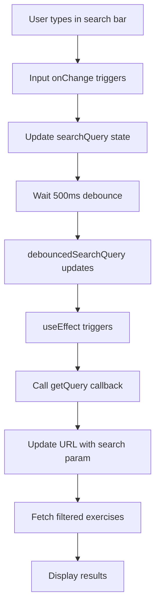

## Overview

BodyWorks includes a powerful search feature that lets you quickly find exercises by name. The search bar uses debounced input to provide a smooth, responsive experience while searching through the entire exercise database.

<CardGroup cols={2}>
  <Card title="Instant search" icon="magnifying-glass">
    Real-time results as you type with 500ms debounce
  </Card>
  <Card title="Search by name" icon="text">
    Find exercises using their titles and names
  </Card>
  <Card title="Keyword matching" icon="tags">
    Exercise keywords help expand search results
  </Card>
  <Card title="Responsive UI" icon="mobile">
    Works seamlessly on all device sizes
  </Card>
</CardGroup>

## How search works

### Search component

The search bar is a debounced input component that prevents excessive API calls:

```tsx search-bar.tsx
export const SearchBar = memo(
  ({ getQuery }: { getQuery: (query: string) => void }): React.ReactNode => {
    const [searchQuery, setSearchQuery] = useState<string>("");
    const debouncedSearchQuery = useDebounce(searchQuery, 500);
    
    useEffect(() => {
      if (getQuery) {
        getQuery(debouncedSearchQuery);
      }
    }, [debouncedSearchQuery]);
    
    const onSearchChange: ChangeEventHandler<HTMLInputElement> = (
      event: ChangeEvent<HTMLInputElement>
    ) => {
      setSearchQuery(event.target.value);
    };
    
    return (
      <div className={"mx-auto items-center justify-center"}>
        <Input
          placeholder="Search by name"
          className="font-poppins h-10 xs:text-xs xs:placeholder:text-xs bg-transparent py-3 focus:outline-hidden max-w-lg mx-auto md:text-base md:placeholder:text-base"
          value={searchQuery}
          onChange={onSearchChange}
        />
      </div>
    );
  }
);
```

### Key features

<Accordion title="Debounced input">
  Search uses a 500ms debounce delay, meaning:
  - The search doesn't trigger on every keystroke
  - Wait 500ms after you stop typing
  - Then the search query is sent
  - Reduces unnecessary API calls
  - Improves performance and responsiveness
  
  This prevents overwhelming the server while still feeling instant to users.
</Accordion>

<Accordion title="Memoized component">
  The SearchBar is wrapped in `React.memo()` to prevent unnecessary re-renders:
  - Only re-renders when props change
  - Maintains search state efficiently
  - Optimizes performance in large lists
</Accordion>

<Accordion title="Responsive design">
  The search input adapts to screen size:
  - Small text on mobile (`xs:text-xs`)
  - Normal text on desktop (`md:text-base`)
  - Centered with max-width constraint
  - Transparent background that adapts to theme
</Accordion>

## Where search is available

### Exercises page

The main search implementation is on the exercises page:

```typescript exercises/page.tsx
function ExercisesContent() {
  const router = useRouter();
  const searchParams = useSearchParams();
  const pathName = usePathname();
  
  const page = Number(searchParams?.get("page")) || 1;
  
  const { isLoading, exercises, error, refetch, isRefetching } = useExercises(
    9,
    page
  );
  
  const getSearchQuery = useCallback(
    (query: string) => {
      if (query) {
        router.push(`/exercises?search=${query}`);
      } else {
        const url = `${pathName}?${searchParams}`;
        router.push(url);
      }
    },
    [router, pathName, searchParams]
  );
  
  return (
    <>
      <SearchBar getQuery={getSearchQuery} />
      <div className={cn("w-full lg:grid lg:grid-cols-2 2xl:grid-cols-3")}>
        {exercises?.data.map((exercise: IExercise) => {
          return (
            <DescriptedCard
              key={exercise.id_}
              id={exercise.id_}
              gif={exercise.gifUrl}
              title={exercise.title}
              blog={exercise.blog}
            />
          );
        })}
      </div>
      <PaginationProvidor
        currentPage={page}
        totalPages={exercises?.totalPages || 0}
      />
    </>
  );
}
```

### URL-based search

Search queries are reflected in the URL:

```text
/exercises                    → All exercises
/exercises?search=bench       → Search for "bench"
/exercises?search=squat       → Search for "squat"
```

This allows:
- Shareable search results
- Browser back/forward navigation
- Bookmarking searches
- Deep linking to search results

## What can be searched

### Exercise fields

The search functionality matches against exercise data:

```typescript
interface IExercise {
  name: string;              // Exercise identifier (searchable)
  title: string;             // Display name (searchable)
  keywords: string[];        // Search keywords (searchable)
  // ... other fields
}
```

### Searchable content

<Steps>
  <Step title="Exercise names">
    Search matches exercise names and titles:
    - "bench press"
    - "squat"
    - "deadlift"
    - "pull up"
  </Step>
  
  <Step title="Exercise keywords">
    Keywords expand search results:
    - "chest" → finds chest exercises
    - "compound" → finds compound movements
    - "beginner" → finds beginner-friendly exercises
    - "strength" → finds strength training exercises
  </Step>
  
  <Step title="Partial matches">
    Search works with partial text:
    - "press" → finds all press variations
    - "curl" → finds bicep curls, leg curls, etc.
    - "fly" → finds chest flys, reverse flys, etc.
  </Step>
</Steps>

## Search patterns and tips

### Effective searching

<Tabs>
  <Tab title="By exercise name">
    Search for specific exercises:
    
    ```text
    "bench press"     → Barbell Bench Press, Dumbbell Bench Press
    "bicep curl"      → Various curl variations
    "leg press"       → Leg press machine exercises
    "shoulder press"  → Overhead press variations
    ```
  </Tab>
  
  <Tab title="By movement pattern">
    Find exercises by type of movement:
    
    ```text
    "press"    → All pressing movements
    "row"      → All rowing movements
    "fly"      → All fly variations
    "extension" → Extension exercises
    "curl"     → Curling movements
    ```
  </Tab>
  
  <Tab title="By keyword">
    Use keywords to find categories:
    
    ```text
    "compound"  → Multi-joint exercises
    "isolation" → Single-joint exercises
    "beginner"  → Beginner-friendly options
    "advanced"  → Advanced techniques
    "strength"  → Strength-focused movements
    ```
  </Tab>
  
  <Tab title="By equipment">
    Search for equipment-specific exercises:
    
    ```text
    "barbell"    → Barbell exercises
    "dumbbell"   → Dumbbell variations
    "cable"      → Cable machine exercises
    "bodyweight" → No equipment needed
    ```
  </Tab>
</Tabs>

### Search tips

<Note>
  **Pro tips for better results:**
  
  - Use specific terms: "bench" is better than "chest"
  - Try different variations: "pullup", "pull up", "pull-up"
  - Start broad, then narrow: "press" → "shoulder press"
  - Check spelling: Ensure correct spelling for best matches
  - Use partial words: "should" will find "shoulder" exercises
</Note>

## Combining search with filters

While search is text-based, you can combine it with filter navigation:

### Example workflow

<Steps>
  <Step title="Start with a filter">
    Filter by body part, equipment, or target muscle:
    - Visit `/equipments/dumbbell`
    - Shows all dumbbell exercises
  </Step>
  
  <Step title="Refine with search">
    From there, you could:
    - Go to `/exercises`
    - Search for "dumbbell press"
    - Get more specific results
  </Step>
  
  <Step title="Explore related">
    Click through to exercise details:
    - View target muscles
    - Check equipment requirements
    - Find similar exercises
  </Step>
</Steps>

## Search behavior

### Empty results

When no exercises match your search:

```tsx
if (exercises && exercises.data.length === 0) {
  return (
    <div className="flex h-full w-full items-center justify-center">
      <h1 className="text-2xl font-bold text-gray-500">
        No exercises found.
      </h1>
    </div>
  );
}
```

The page displays a clear "No exercises found" message.

### Loading states

While searching, the page shows:
- Loading skeletons during initial load
- Smooth transitions between states
- Responsive feedback for user actions

### Clearing search

To clear your search:

1. Delete text from the search bar
2. Wait for debounce (500ms)
3. Returns to showing all exercises
4. Or navigate directly to `/exercises`

## Search performance

### Optimization techniques

<CardGroup cols={2}>
  <Card title="Debouncing" icon="clock">
    500ms delay prevents excessive API calls while typing
  </Card>
  
  <Card title="Memoization" icon="memory">
    React.memo prevents unnecessary component re-renders
  </Card>
  
  <Card title="URL state" icon="link">
    Query parameters enable sharing and navigation
  </Card>
  
  <Card title="Pagination" icon="list">
    Results limited to 9 per page for fast rendering
  </Card>
</CardGroup>

### Best practices

For optimal search experience:

- Wait for debounce to complete before typing more
- Use specific search terms when possible
- Combine with filters for better narrowing
- Check exercise keywords if you don't find what you need
- Try alternative spellings or terms

## Technical implementation

### Search flow



### Integration points

Search integrates with:

1. **URL routing**: Search queries in URL parameters
2. **Exercise hooks**: `useExercises()` accepts search parameters
3. **Pagination**: Works alongside paginated results
4. **Error handling**: Graceful fallbacks for failed searches

<Warning>
  Search is case-insensitive on most implementations, but this depends on your backend API configuration. Test with both upper and lowercase to confirm behavior.
</Warning>

## Future enhancements

Potential search improvements:

- Advanced filters (multiple muscles, equipment)
- Autocomplete suggestions
- Search history
- Saved searches
- Fuzzy matching for typos
- Search by muscle group
- Voice search capability

<Card title="Explore all features" icon="compass" href="/features/exercises">
  Return to exercise database overview to learn about all 1300+ exercises
</Card>